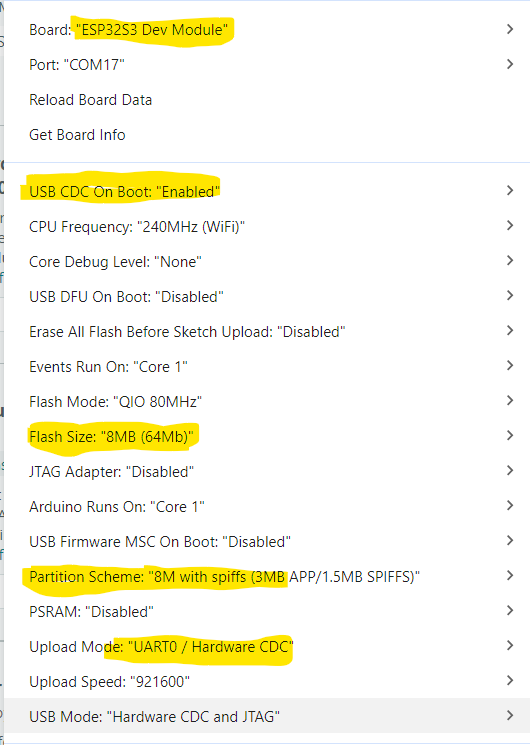

# ESP32 CAN Button Controller for AgOpenGPS

> ⚠️ **CRITICAL SAFETY DISCLAIMER** ⚠️
> 
> **WARNING: This device is for DEVELOPMENT and TESTING purposes only.**
> 
> ⚠️ **NEVER use this on a real tractor during actual field operations.**
> 
> ⚠️ **ONLY use on a closed test course with proper safety supervision.**
> 
> ⚠️ **MUST be powered from the autosteer solution's power supply** so when the autosteer is disabled/killed, this device loses power and stops transmitting on the CAN bus.
> 
> ⚠️ **I (the creator) accept NO RESPONSIBILITY for any damage, injury, or accidents resulting from misuse of this device.**
> 
> **Use at your own risk. Proper safety protocols and testing are mandatory.**

## Summary

This project implements a CAN bus button controller based on ESP32 that integrates with AgOpenGPS agricultural guidance systems. The device monitors CAN bus traffic from various tractor brands (Deutz/Valtra/MF, CaseIH/New Holland, Fendt, FendtOne) and triggers an engage output when specific steering engagement messages are detected. The controller supports SLCAN protocol for diagnostics and configuration via serial communication.


## Features

- **Multi-brand CAN Support**: Works with Deutz/Valtra/MF, CaseIH/New Holland, Fendt, and FendtOne tractors
- **SLCAN Protocol**: Compatible with diagnostic tools like SavvyCAN
- **Configurable Engagement**: Adjustable hold time and brand-specific message filtering
- **Serial Configuration**: Real-time setup via serial commands
- **Diagnostic LEDs**: Visual feedback for engagement status
- **Robust Timing**: Configurable output hold duration to prevent flickering

## Origins & Inspiration

This project was inspired by:
- **[MechanicTony/AOG_CAN_Teensy4.1](https://github.com/MechanicTony/AOG_CAN_Teensy4.1)** - Original CAN implementation concept
- **[LCSC ESP32S3R8N8 Dev Board](https://oshwlab.com/lckfb-team/lcsc-esp32s3r8n8-dev-board)** - PCB design influence

## Hardware Overview

### Key Components
- **Microcontroller**: ESP32 (supports TWAI CAN controller)
- **CAN Transceiver**: SN65HVD231 or equivalent
- **Status LED**: GPIO18 for engagement indication
- **Serial Interface**: USB for configuration and diagnostics
- **Power**: 5V-12V input support

### Pin Configuration
```cpp
#define engageLED 18    // Engagement status LED
#define CAN_TX 10       // CAN transceiver TX
#define CAN_RX 11       // CAN transceiver RX
```

## Software Implementation

### Core Functionality

#### CAN Message Monitoring
The system monitors specific CAN IDs for each supported brand:

**Brand 1 (Deutz/Valtra/MF):**
- ID: `0x18FF5806`
- Engage condition: `data[4] == 0x01`

**Brand 2 (CaseIH/New Holland):**
- ID: `0x14FF7706`
- Engage conditions: `(data[0] == 130 && data[1] == 1)` OR `(data[0] == 178 && data[1] == 4)`

**Brand 3 (Fendt):**
- ID: `0x613` (standard frame)
- Engage pattern: `{0x15, 0x22, 0x06, 0xCA, 0x80, 0x01, 0x00, 0x00}`

**Brand 5 (FendtOne):**
- ID: `0xCFFD899`
- Engage condition: `data[3] == 0xF6`

#### Output Control Logic
```cpp
#define OUTPUT_HOLD_MS 100      // Minimum output hold time (ms)
unsigned long engageHoldUntil = 0;  // Time until output can go low
boolean engageState = false;        // Current engage state
```

The engage output follows this logic:
1. When engage condition is detected: LED turns ON immediately
2. Output remains HIGH for minimum `OUTPUT_HOLD_MS` duration
3. After hold period, output can turn OFF when non-engaged messages are received
4. Prevents rapid on/off cycling during brief signal fluctuations

### SLCAN Protocol Support

Full SLCAN (Serial Line CAN) implementation for diagnostics:
- `O` - Open CAN bus
- `C` - Close CAN bus  
- `t/T` - Send standard/extended frames
- `r/R` - Send RTR frames
- `S2-S8` - Set CAN baud rates (50k to 1M)
- `B1/B2/B3/B5` - Select tractor brand
- `BA` - Enable all brands mode

## Configuration Commands

### Brand Selection
```
B1    = Deutz/Valtra/MF
B2    = CaseIH/New Holland  
B3    = Fendt
B5    = FendtOne (auto 500k baud)
BA    = All supported brands (default)
B1C   = Brand with address claim
```

### CAN Bus Settings
```
S2    = 50k baud
S3    = 100k baud
S4    = 125k baud
S5    = 250k baud (default)
S6    = 500k baud
S8    = 1000k baud
```

## Installation & Setup

### Arduino IDE Configuration

1. **Install ESP32 Board Package**:
   - Tools → Board → Boards Manager
   - Search for "esp32" by Espressif Systems
   - Install version 3.0.1 or later

2. **Board Settings**:
   ```
   Board: ESP32S3 Dev Module
   Upload Speed: 921600
   ```



3. **Upload the Sketch**:
   - Open `joysticksteerbutton.ino`
   - Select appropriate COM port
   - Compile and upload

## Flashing the Firmware

### Method 1: Arduino IDE (Recommended)
Use Arduino IDE to compile and flash the firmware:
1. Open `joysticksteerbutton.ino` in Arduino IDE
2. Select your ESP32 board and COM port
3. Click Upload button

### Method 2: Manual Flash with Pre-built Binaries

If you have the pre-built binary files in the `build` folder, you can flash directly using esptool:

```bash
esptool.exe --chip esp32s3 --port "COM18" --baud 460800 --before default_reset --after hard_reset write_flash -z --flash_mode dio --flash_freq 80m --flash_size 8MB 0x0 ./build/joysticksteerbutton.ino.bootloader.bin 0x8000 ./build/joysticksteerbutton.ino.partitions.bin 0xe000 ./build/boot_app0.bin 0x10000 ./build/joysticksteerbutton.ino.bin
```

**Notes:**
- This method is useful when you have pre-built binaries or need to flash without Arduino IDE
- Replace `COM18` with your actual COM port
- To list available COM ports on Windows, use: `mode` command in Command Prompt
- Ensure all binary files are in the `./build/` directory
- The baud rate is set to 460800 for faster flashing
- Make sure the ESP32-S3 is in bootloader mode (usually by holding BOOT button while pressing RESET)

### Initial Configuration

Connect via serial monitor (2000000 baud) and send:
```
O          # Open CAN bus
S5         # Set 250k baud (adjust as needed)
B2         # Select your tractor brand
```

## PCB Design Files

Complete PCB design files are available in the `PCB/` folder:
- **Gerber_PCB_2026-01-26.zip** - Manufacturing files
- **BOM_LCSC ESP32S3R8N8 Dev Board V1.0.0_PCB_2026-01-26.xlsx** - Bill of Materials
- **PickAndPlace_PCB_2026-01-26.xlsx** - Placement guide
- **ProPrj_ESP32S3R8N8 CAN Board_2026-01-26.epro** - EasyEDA project file

## Troubleshooting

### Common Issues

**LED Stays On Permanently**:
- Ensure `resetEngageOutput()` is called for non-engaging messages
- Check that the correct brand is selected
- Verify CAN bus baud rate matches tractor

**No CAN Communication**:
- Confirm proper CAN transceiver wiring
- Check power supply to CAN transceiver
- Verify baud rate settings match tractor

**SLCAN Not Responding**:
- Ensure serial monitor is set to 2000000 baud
- Send `h` command for help and current status
- Check that CAN bus is opened with `O` command

### Diagnostic Commands

Send `h` for help and current configuration:
```
ESP32 SLCAN - AgOpenGPS

O     = Open CAN
C     = Close CAN
t     = Send std frame
T     = Send ext frame
...
Speed: 250000 bps
SLCAN: ON
Brand: 2
```

## License

GPL 3.0

## Contributing

Feel free to submit issues and enhancement requests!